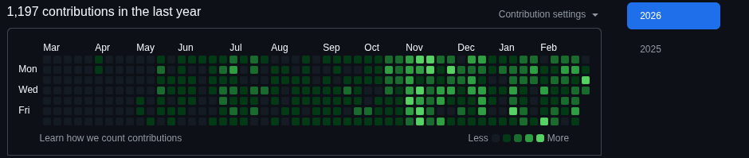

# Asif Faisal | Full-Stack Developer & System Architecture Specialist

## � Professional Profile

I am **Asif Faisal**, a results-driven **Full-Stack Developer** and **System Architecture Specialist** based in Dhaka, Bangladesh. With over 2 years of professional experience, I specialize in building scalable web applications, robust financial platforms, and high-performance microservices.

My expertise lies at the intersection of **Finance (Bachelor Degree)** and **Technology (Software Development)**, allowing me to build technically precise systems that solve complex business challenges. I am proficient in modern backend frameworks like **Python (Django, FastAPI)** and frontend technologies like **JavaScript/TypeScript (React, Next.js)**.

---

## 🛠️ Specialized Skill Set

### **Backend Engineering**
- **Languages:** Python, JavaScript, TypeScript, SQL, HTML/CSS
- **Frameworks:** Django, Django REST Framework (DRF), FastAPI
- **Real-time Systems:** WebSockets, Django Channels
- **Natural Language Processing:** Spacy

### **Frontend & UI/UX**
- **Core:** React, Next.js, Tailwind CSS
- **Design:** Modern UI/UX principles, Responsive Layouts

### **Cloud & DevOps**
- **Infrastructure:** AWS, Google Cloud Platform (GCP)
- **Containerization:** Docker, Docker Compose
- **Automation:** GitHub Actions (CI/CD)
- **Monitoring & Reliability:** Microservices Architecture, API Gateways

### **Database & State**
- **Databases:** PostgreSQL, MySQL, Redis
- **Modeling:** Database Design, Schema Optimization

---

## 📈 Key Career Achievements

- ⚡ **Real-time Solutions:** Implemented WebSocket-based data streaming, reducing client latency by **60%**.
- �️ **DevOps Efficiency:** Built automated CI/CD pipelines achieving zero-downtime releases.

---

## 📊 GitHub Technical Activity

To showcase my consistent contributions and technical engagement, here is a snapshot of my activity:

### **🔥 Contribution & Streak Stats**

> [!TIP]
> **To show "private" green contributions:**
> Go to your GitHub profile, click the **Contribution Settings** dropdown (above the graph), and check **Private contributions**.
---

## 💼 Core Experience Highlights

### **Full Stack Software Developer | Exoveon Ltd.**
*Sep 2025 – Present*
Architected microservices, built CI/CD pipelines, and engineered API Gateways for high-availability production workloads.

### **Backend Developer | OrbitX Ltd.**
*Nov 2024 – Jun 2025*
Developed complex product inventory systems, orchestrated Docker deployments, and implemented automated backup strategies.

---

## 🎓 Education & Certifications

- **Bachelor Degree** | Jashore University of Science and Technology (2020 – 2024)
  - *Focus: Finance, System Architecture*
  - *Activities: Finance Club Member, Seminar Organizer, Community Service Volunteer*
- **Data Analysis with Python** | EDGE Project, BCC, ICT Division
- **Full Stack Web Development** | Python, Django & React (Ostad)
- **Developing Scalable Apps in Python** | Google Cloud Training

---

## 📬 Contact Information

- 📧 **Email:** [f.asif.official@gmail.com](mailto:f.asif.official@gmail.com)
- 📍 **Location:** Dhaka, Bangladesh
- 📞 **Phone:** +880 1516-373037

---

